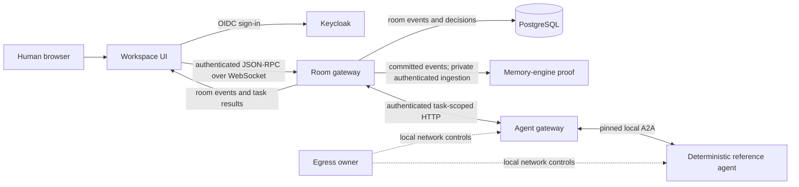
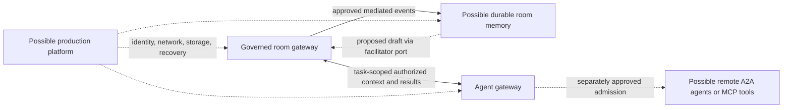

# ThoughtKhoral architecture evolution

## Status

Draft explanatory architecture brief. The current-state view summarizes approved specifications and the local development stack as documented on 2026-09-24. Future views are options under consideration, not approved deployment designs or release commitments. The solution architecture and accepted decisions in the [specification index](../README.md#current-root-specifications), component specifications, and [roadmap](../../../docs/roadmap.md) govern their respective scopes.

## Current local architecture

The room gateway is the only authority for room authorization, persisted events, delivery, and active-decision transitions. The workspace UI presents gateway events and human controls. PostgreSQL stores the governed room record. The memory engine receives committed events through private mediated ingestion and currently proves room-scoped in-memory graph/provenance only; it has no active facilitator connection or durable memory store. The agent gateway receives a task-bound context packet filtered by room visibility, invokes one pinned deterministic A2A reference agent, and returns validated updates through the room gateway. The local egress owner constrains the two agent processes. Contracts are versioned JSON Schema and protocol artifacts pinned by runtime consumers, not a separate runtime service. See the [repository map](../../../docs/repository-map.md), [compatibility matrix](../../../docs/compatibility-matrix.md), [platform specification](../../../thought-khoral-platform/.ai/specs/what/local-mvp.md), and [agent gateway design](../../../thought-khoral-agent-gateway/.ai/specs/how/a2a-agent-gateway-foundation.md).

### Representative governed task flow

1. A human enters a room and requests an allowed skill.
2. The room gateway authenticates and authorizes the request, persists the task, and assembles the ordered context visible to both requester and registered agent.
3. The agent gateway binds the expiring packet to that task and invokes the pinned reference agent.
4. The room gateway validates citations, revision, lease, and lifecycle state before persisting each normalized task update.
5. The UI renders persisted progress and a cited result. No agent update activates a decision.

This flow is specified in [decision 007](../decisions/007-a2a-agent-gateway-foundation.md) and the [agent gateway How](../../../thought-khoral-agent-gateway/.ai/specs/how/a2a-agent-gateway-foundation.md#invocation-and-context-flow).

## Evolution tracks under consideration

These tracks can be evaluated independently. Arrows below indicate a possible dependency or trust boundary, not an approved implementation sequence.

| Track | Possible architecture | Decision gate before implementation |
| --- | --- | --- |
| Room-derived memory | Add Cognee-backed extraction and durable room-partitioned facts/lineage behind the separate memory engine. A later approved implementation could supply draft candidates through the gateway-owned facilitator port; humans would still approve active decisions. | Validate Cognee compatibility and licensing, storage and migration design, provenance and failure behavior, and a specific facilitator activation plan. See [memory POC scope](../../../thought-khoral-memory-engine/.ai/specs/what/poc-room-scoped-memory.md). |
| Broader agent interoperability | Extend the mediated agent gateway from one pinned local reference agent to separately admitted remote agents and possibly MCP tools. Preserve task binding, audience filtering, provenance, and gateway authority. | Approve admission, endpoint/card trust, credentials, isolation, tool policy, egress, contract changes, and operational recovery. See [decision 007](../decisions/007-a2a-agent-gateway-foundation.md). |
| Context efficiency | Replace full authorized-history task packets with deltas, retrieval, or compact representations while retaining reconstructable provenance and authorization semantics. | Specify revision/caching semantics, expiry, revocation, citation behavior, and compatibility fixtures. See [agent gateway design](../../../thought-khoral-agent-gateway/.ai/specs/how/a2a-agent-gateway-foundation.md#packet-and-task-invariants). |
| Production platform | Define an OpenShift deployment for the approved runtime components with production identity, network controls, storage, observability, and recovery. | Establish workload identity, mutual TLS, networking, storage, capacity, failure targets, and an operational validation plan. Local Compose and Kubernetes manifest checks do not establish this design. See [platform scope](../../../thought-khoral-platform/.ai/specs/what/local-mvp.md). |
| Project/topic hierarchy | Introduce parent project or topic scope around rooms and any new conversation identity only through a compatible contract and data-model decision. | Define user need, identifiers, migrations, authorization inheritance, memory partition, and replay behavior. The current POC treats one room as one conversation. See [decision 005](../decisions/005-room-scoped-poc-memory.md). |

## Future boundary sketch

The sketch deliberately leaves product choices open. It does not select a remote-agent trust model, a memory database, a topology, or a production service set. Technologies named in the solution architecture listed in the [specification index](../README.md#current-root-specifications)—including pgvector, Cognee-RS, SPIFFE/SPIRE, Serverless/Knative, Service Mesh, Strimzi, ODF, model hosting, and Wasm isolation—are candidates subject to separate requirement and compatibility review. No future path gives a memory or agent service direct authority to activate room decisions.

## Documentation rules for derived architecture content

- Label diagrams and statements as **current local**, **approved but not implemented**, or **under consideration** at the capability level.
- Present the memory-engine ingestion proof separately from proposed Cognee extraction and facilitator activation.
- Present the pinned local A2A agent separately from remote or user-supplied agent admission.
- Use the [compatibility matrix](../../../docs/compatibility-matrix.md) and component release locks for claims about a particular build.
- Update this brief after an accepted decision changes a boundary; do not treat this brief as approval for the future tracks.
