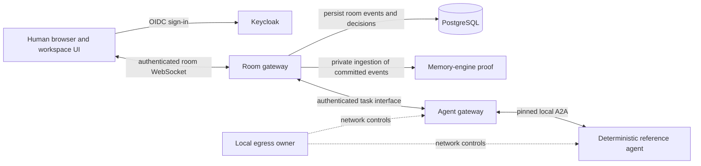

# ThoughtKhoral architecture

> **Documentation draft.** The current view summarizes the [approved root specifications](../.ai/specs/README.md), [component map](repository-map.md), and [compatibility matrix](compatibility-matrix.md) for the local development stack documented on 2026-09-24. Possible future boundaries come from the draft [architecture evolution brief](../.ai/specs/how/architecture-evolution.md); they are not approved production designs.

## Current local system

The **room gateway** is the authority for authorization, room event persistence, replay and delivery, and active-decision transitions. The **workspace UI** presents those events and human controls; it does not make an agent result authoritative. **Keycloak** supplies development identity, and **PostgreSQL** holds the governed room record. Versioned contract artifacts define the room interface and are pinned by the relevant consumers; contracts are not a running service.

The **memory engine** currently receives committed events through private mediated ingestion and proves room-scoped graph and provenance behavior in memory. It does not read the gateway database, operate an active facilitator, or store derived memory durably. The **agent gateway** receives task-scoped authorized context from the room gateway, calls one pinned deterministic A2A reference agent, and returns validated task updates. Neither the agent gateway nor the reference agent can change active decisions or directly access room storage. The local egress owner constrains their network access. See the [platform specification](../thought-khoral-platform/.ai/specs/what/local-mvp.md) and [agent gateway design](../thought-khoral-agent-gateway/.ai/specs/how/a2a-agent-gateway-foundation.md).

## How a controlled agent task moves through the system

1. A human enters a room and requests one of the reference agent's two allowed skills.
2. The room gateway authenticates the request, creates a durable task, and assembles an expiring context packet from history visible to both the requester and the agent.
3. The agent gateway invokes the pinned A2A agent and receives status and a result.
4. The room gateway validates task identity, context revision, citations, lease, and lifecycle state before persisting normalized updates.
5. The UI renders the persisted progress and cited result. A separate human decision action would be required to change active room context.

This flow is governed by [decision 007](../.ai/specs/decisions/007-a2a-agent-gateway-foundation.md). The earlier `@action-items` mention path runs inside the room gateway and is separate from this A2A path.

## Possible future boundaries

The table describes design work under consideration, not a deployment plan or schedule. The [roadmap](roadmap.md) tracks the next approval gate for each capability.

| Area | Possible change | What must be specified first |
| --- | --- | --- |
| Room memory | Cognee-backed extraction and durable, room-partitioned facts and lineage; a later memory implementation could submit draft candidates through the gateway-owned facilitator port. | Compatibility and license evidence, storage and migration design, provenance and failure behavior, and a facilitator activation plan. Human approval remains required for active decisions. |
| External agents and tools | Separately admitted remote A2A agents and possible MCP integration through the agent gateway. | Admission and trust, identity, isolation, tool policy, egress, contracts, and recovery. The pinned local reference agent does not establish open admission. |
| Agent context | Compact, delta, or retrieval-based packets in place of the current full authorized-history packet. | Revision, cache, revocation, expiry, citation, and compatibility semantics that preserve authorization and reconstructable provenance. |
| Production platform | An OpenShift deployment with production identity, networking, storage, observability, and recovery. | Workload identity, mutual TLS, capacity, failure targets, storage, and operational validation. Rootless Compose and Kubernetes manifest validation are local development evidence only. |
| Project and topic structure | Parent project or topic scope around rooms. | User need, identifiers, migrations, authorization inheritance, memory partitioning, and replay rules. The current memory POC treats a room as one conversation. |

The [architecture evolution brief](../.ai/specs/how/architecture-evolution.md) records these decision gates. Candidate technologies in the approved solution direction are evaluation inputs, not a selected future stack. Any later design must preserve the room gateway's authority over active decisions and the mediated disclosure of room context.
